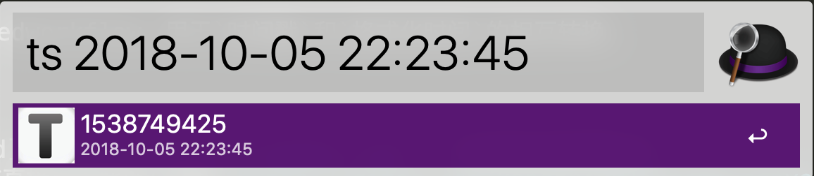
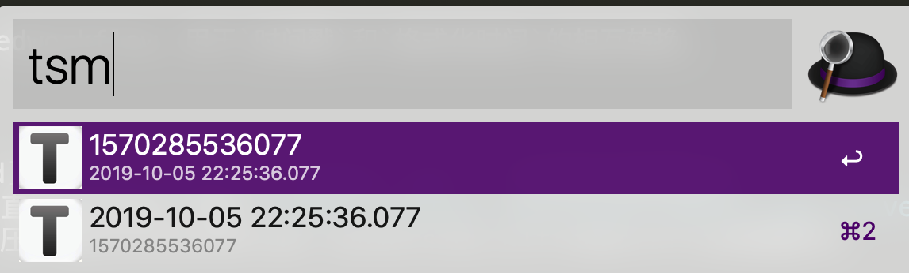

## time conversion alfredworkflow是什么?

基于PHP开发的alfredworkflow，用于`时间戳`和`格式化时间`的相互转换。

## 安装方法：

* 1.先安装[Alfred](https://www.alfredapp.com/)，已安装的直接第2步。
* 2.git clone 或直接点击此处[下载](https://github.com/kangzhi2016/time-conversion-alfredworkflow/releases)
* 3.下载完成后，解压，双击文件夹中的time conversion.alfredworkflow安装即可。

## 使用说明：

* 1.默认在alfred搜索框中输入关键字 “ts” ，显示当前时间戳和格式化后的时间。

* 

* 2.在关键字 “ts”后输入**空格**+要转换的时间，即可在列表中得到想要的时间格式，选中想要的格式，回车就复制到剪切板了。
 
* 

* 3.新增 13 位微妙时间戳，用法同上，只是关键字为 “tsm”。

* 

##有问题反馈
在使用中有任何问题，欢迎反馈给我，可以用以下联系方式跟我交流

* QQ: 1563659827
* 邮件: 1563659827@qq.com
* 简书: [@拿破仑蛋糕](https://www.jianshu.com/u/ba651d19aa1f)

